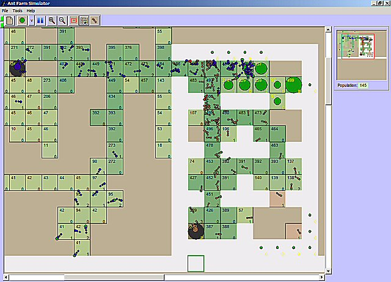



## Ant Farm Simulator

### Description

The goal of this software is to emulate ants ability to coordinate into the task of food-gathering, by mean of short-span individual reactions to environment events.

The algorithm used on this simulation considers, among others, the following points:

Individual ant brain does not have the enough capacity to remember neither food or nest locations.

Ants react to the environment secreting scents, which are impregnated on the ground (odor traces).

Odor traces have a limited persistence, vanishing as time pass.

When an ant finds some odor trace of interest, it increase it adding some extra amount of scent.

Ants cannot 'clean' odor traces as they find them; just increase them or ignore them.

On this simulation, ants use two kind of odor marks. The first, in brown, is secreted when the ant finds the nest. The second one, in green, is secreted when the ant finds food (See screenshot).

When abandoning the nest, ants move randomly in search of food ('explorer' behavior), leaving an odor trace whose intensity reach his maximum value on the nest. When they find food, they mark its location using a food trace, analogous to the one used when they find the nest. Ants carrying food follow the food trace from higher to lower intensity; the nest trace is followed from lower to higher intensity ('deliverer' behavior). Ants carrying no food follow food traces from lower to higher intensity ('tracker' behavior)
 
### More Info
 

             |
---                |---
**Submitted On**   |2004-04-17 19:35:34
**By**             |[Roberto Aguirre Maturana](https://github.com/Planet-Source-Code/PSCIndex/blob/master/ByAuthor/roberto-aguirre-maturana.md)
**Level**          |Advanced
**User Rating**    |4.8 (43 globes from 9 users)
**Compatibility**  |VB 6\.0
**Category**       |[Miscellaneous](https://github.com/Planet-Source-Code/PSCIndex/blob/master/ByCategory/miscellaneous__1-1.md)
**World**          |[Visual Basic](https://github.com/Planet-Source-Code/PSCIndex/blob/master/ByWorld/visual-basic.md)
**Archive File**   |[Ant\_Farm\_S20311311152006\.zip](https://github.com/Planet-Source-Code/roberto-aguirre-maturana-ant-farm-simulator__1-67102/archive/master.zip)

